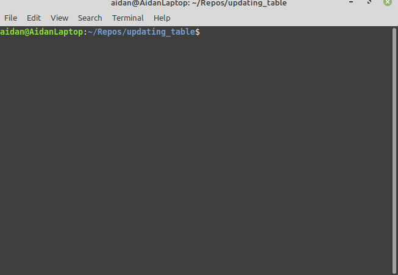

# Introduction

This example demonstrates how to show live information in a tabular format.

It uses the python [tabulate](https://github.com/astanin/python-tabulate) library and [ANSI escape codes](https://en.wikipedia.org/wiki/ANSI_escape_code).

# Example

